# PersonaStamp Studio

**メインアプリ**: [AXiV — しゃべるスタンプ](#axiv--しゃべるスタンプ)（App Store 公開中の iOS アプリ）  
このリポジトリでは、音声付きスタンプ作成アプリ AXiV、Fish Audio SDK を用いた音声クローン・TTS の **iOS アプリ [RendVu](#rendvu--音声クローンtts-ios-アプリ)**、および Web UI・CLI・API のツール群を管理しています。

[](https://swift.org/)
[](https://developer.apple.com/xcode/swiftui/)
[](https://www.python.org/)
[](LICENSE)

**使用言語**: iOS アプリ（AXiV）は **Swift** と **SwiftUI**、Web UI・CLI・API サーバーは **Python** です。

---

# AXiV — しゃべるスタンプ

**Rendezvous with that Moment.**  
App Store にて公開中の、写真から「音声付きスタンプ」まで一気通貫で作れる iOS アプリです。

---

## 紹介動画

<video src="create_stamp/portfolio/AXiV-App-Preview.mp4" controls width="640" poster="create_stamp/portfolio/AXiV_1.png">  
お使いの環境では動画を再生できません。 [動画をダウンロード](create_stamp/portfolio/AXiV-App-Preview.mp4)
</video>

---

## コンセプト・メッセージ（App Store プロモーション）

### キャッチコピー

**AXiVを通じてあの瞬間と再会しよう。**

必要なのは写真1枚だけ。思い出をあなたの感性で彩り、世界に一つだけの「音声付きスタンプ」として再起動。作成したスタンプは動画形式で保存して、みんなと共有して盛り上がろう。保存じゃない、これは新しい思い出の体験です。

---

### 概要

**【記憶を、体験として再起動する。】**

AXiVは、あなたの写真に新しい命を吹き込む、次世代のスタンプ作成アプリです。  
*Rendezvous with that moment through the AXiV.*

あの日の記憶、大切な人との時間、ふとした瞬間の感情。AXiVは、それらを単なる「保存物」から、もう一度触れられる「体験」へとアップデートします。

---

### AXiVでできること

スマホに眠っている写真1枚から、驚くほど簡単にハイクオリティなスタンプを作成できます。

1. **AI背景除去** — 思い出の主役だけを鮮やかに切り出し
2. **ベース構成** — 透過や白背景など、スタンプの土台を自在に構築
3. **感性エディタ** — 今の気分でお絵描きやデコレーションをプラス
4. **音声生成（AIボイス）** — 入力した文字をスタンプが喋り出す
5. **動画形式で保存** — 作成したスタンプは、声も一緒に共有可能

---

### AXiVという名前に込めた想い

- **Archive Experience in Vision** — 記憶を視点と感情で再起動する。
- **Axis + Rendezvous** — 記憶という「軸」で、過去の自分や大切な人と「再会」する交差点。

ただの画像作成ツールではありません。AXiVは、あなたの思い出をあなたの感性でカスタマイズし、仲間と共有して盛り上がるための、新しいコミュニケーションの形です。

---

### こんな方におすすめ

- 友達との思い出をもっと楽しく共有したい
- 世界に一つだけの手作りスタンプを作りたい
- 写真にメッセージや声を乗せて届けたい
- 最新のAI技術を使ってエモいコンテンツを作りたい

**さあ、AXiVを起動して。  
思い出と、もう一度出会おう。**

---

## 主な機能（技術面）

| タブ | 機能 |
|------|------|
| **Remove BG** | 画像内の被写体を長押しで選択し、背景を除去。VisionKit の Image Analysis を利用。 |
| **Compose Base** | 背景除去した透過画像を、白/透明の正方形キャンバス（512/1024/2048px）に合成。 |
| **Edit Sticker** | PencilKit で手描き編集。ズームしたまま完了しても、正しい縮尺で画像に合成。 |
| **Audio Sticker** | テキストを TTS で音声化し、画像＋音声の動画（MOV）を作成してフォトライブラリに保存。入力テキストの言語（英/日）を自動判定。 |

起動時は AXiV のスプラッシュを表示し、デバイスの言語（en/ja）に応じて UI を切り替える多言語対応です。

---

## 技術スタック

| 分野 | 技術 |
|------|------|
| **UI** | SwiftUI（iOS 16+ は `NavigationStack`） |
| **背景除去** | VisionKit（`ImageAnalyzer`, `ImageAnalysisInteraction`）— 被写体検出・切り出し |
| **画像編集** | PencilKit（手描き）、`UIGraphicsImageRenderer`（合成） |
| **音声・動画** | AVFoundation（`AVSpeechSynthesizer` / TTS、`AVAssetWriter` / MOV 出力） |
| **言語判定** | NaturalLanguage（`NLLanguageRecognizer`）— TTS 用に en/ja を自動判定 |
| **保存** | Photos（フォトライブラリ） |
| **多言語** | `Localizable.xcstrings`（en/ja） |

処理はすべて **デバイス上** で実行し、画像・音声をサーバーに送信しません。

---

## 実装のポイント

- **構成**: SwiftUI + MVVM に近い構成。View / ViewModel / Model を分離し、タブごとにメインの View を割り当て。
- **背景除去**: VisionKit の `.visualLookUp` で被写体を検出。長押しで選択・タップで解除。抽出画像はメモリ上のみで保持し、保存はユーザーが明示的に実行したときのみ。
- **編集**: PencilKit のキャンバスを `canvasView.bounds` 基準で合成するため、ズーム状態に依存せず一貫した編集結果を画像に反映。
- **TTS**: 入力テキストの言語を自動判定し、英語・日本語の音声を切り替え。生成した音声と画像から MOV を組み立て、フォトライブラリに保存。
- **ローカライズ**: タブ名・ボタン・アラート・説明文を en/ja で管理。App Store 審査（顔データの取り扱い説明など）にも対応済み。

---

## App Store

本アプリは **App Store で公開されています**。

- アプリ名: **AXiV — しゃべるスタンプ**
- 対応: iPhone / iPad（iOS 16.0 以上）

---

## ポートフォリオ用素材

リポジトリ内の `create_stamp/portfolio/` に、アイコン・画面プレビュー・紹介動画を置いています。

| 素材 | ファイル |
|------|----------|
| アプリアイコン | [App Icon Template.png](create_stamp/portfolio/App%20Icon%20Template.png) |
| 紹介動画（App Store 公開） | [AXiV-App-Preview.mp4](create_stamp/portfolio/AXiV-App-Preview.mp4) |
| 画面プレビュー | [AXiV_1.png](create_stamp/portfolio/AXiV_1.png) ～ [AXiV_6.png](create_stamp/portfolio/AXiV_6.png)、[IMG_3491.PNG](create_stamp/portfolio/IMG_3491.PNG) |

### プレビュー画像

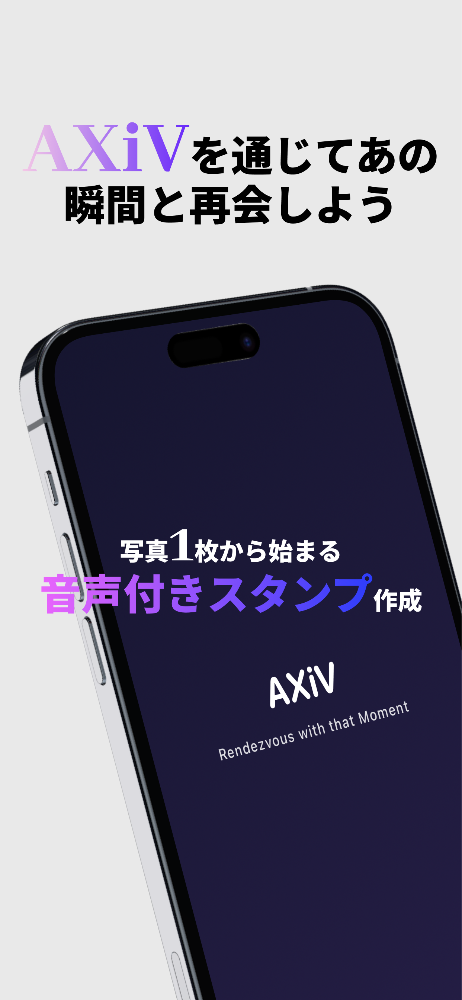 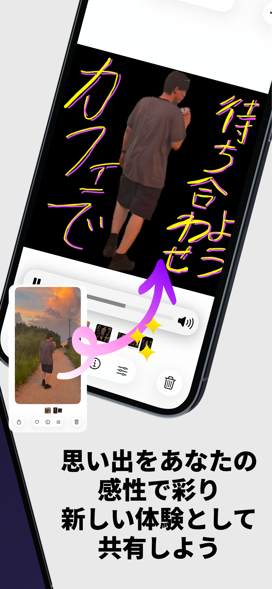 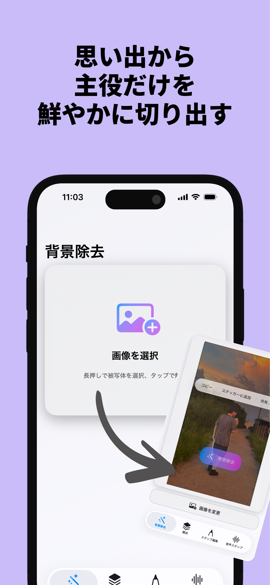

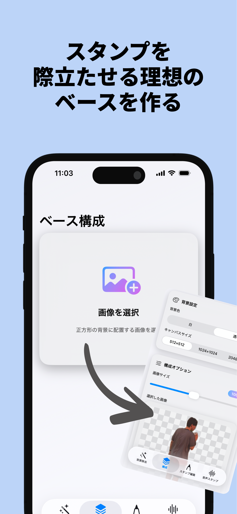 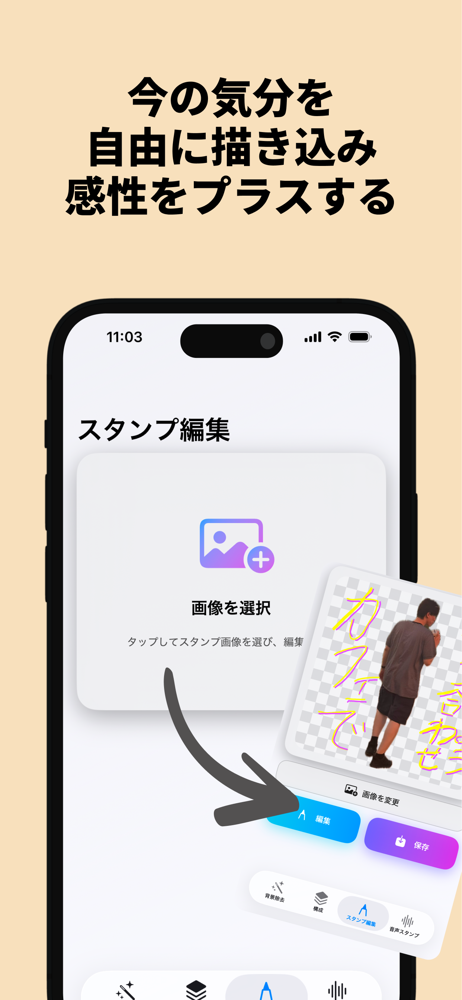 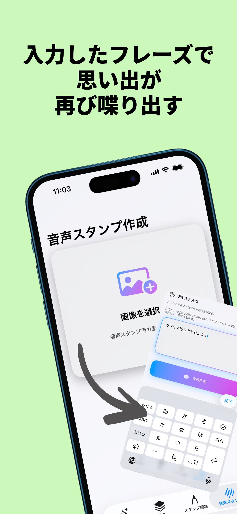

---

## ソースコード・ドキュメント（AXiV）

- **アプリ本体（Xcode プロジェクト）**: [create_stamp/mobile/stamp_creator/](create_stamp/mobile/stamp_creator/)
- **起動・ビルド手順**: [create_stamp/mobile/stamp_creator/README.md](create_stamp/mobile/stamp_creator/README.md)
- **設計仕様・データフロー**: [create_stamp/mobile/stamp_creator/docs/Design_Specification.md](create_stamp/mobile/stamp_creator/docs/Design_Specification.md)

---

# RendVu — 音声クローン・TTS iOS アプリ

**RendVu** は、[Fish Audio SDK](https://fish.audio) を活用した**音声クローン（Voice Cloning）**と**テキスト読み上げ（TTS）**の iOS アプリです。本リポジトリの Web 版（Streamlit / CLI）に対応する **iOS 版**として開発されています。

| 項目 | 内容 |
|------|------|
| プラットフォーム | iOS 15.0+ |
| UI | SwiftUI |
| 認証 | Firebase Authentication（Apple Sign In 対応） |
| バックエンド | PersonaStamp TTS API サーバー（ローカル／リモート） |

## 主な機能（RendVu）

| タブ | 機能 |
|------|------|
| **Voice Clone** | 音声サンプルから声を複製し、Fish Audio 経由で音声クローンモデルを作成 |
| **音声処理** | 音源分離（ボーカル抽出）、無音区間削除。処理済み音声を Voice Clone で再利用可能 |
| **TTS** | 作成したモデルでテキストを音声化。感情タグ・文字数制限・フォーマット選択対応 |
| **Models** | 作成済み音声クローンモデルの一覧・管理 |
| **Profile** | ログイン／ログアウト、アカウント情報 |

## ソースコード・ドキュメント（RendVu）

- **アプリ本体（Xcode プロジェクト）**: [api/tts-api-server/src/personastamp_api/ios_app/swift_src/retry_src/RendVu/](api/tts-api-server/src/personastamp_api/ios_app/swift_src/retry_src/RendVu/)
- **詳細 README・セットアップ**: [RendVu/README.md](api/tts-api-server/src/personastamp_api/ios_app/swift_src/retry_src/RendVu/README.md)

## 画面プレビュー（RendVu）

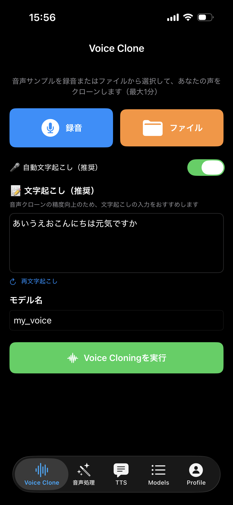 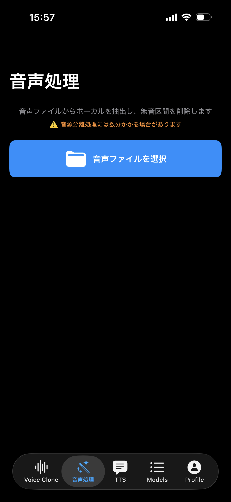 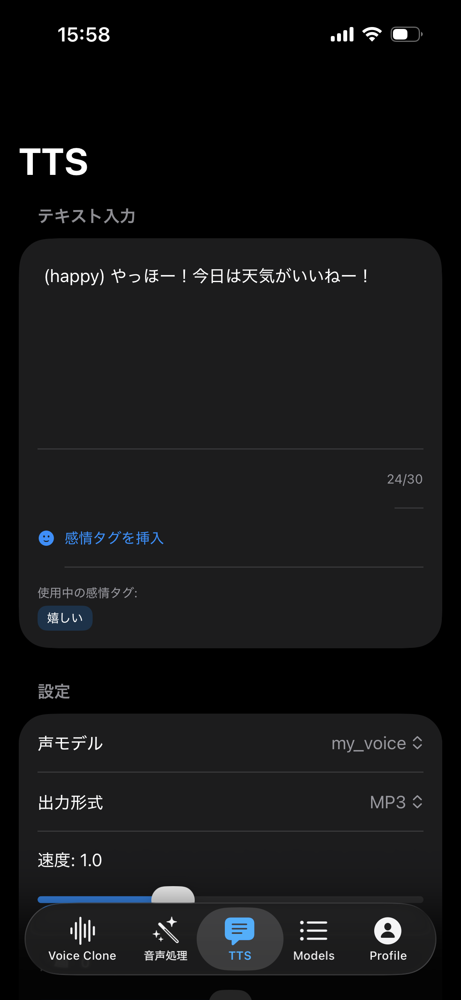 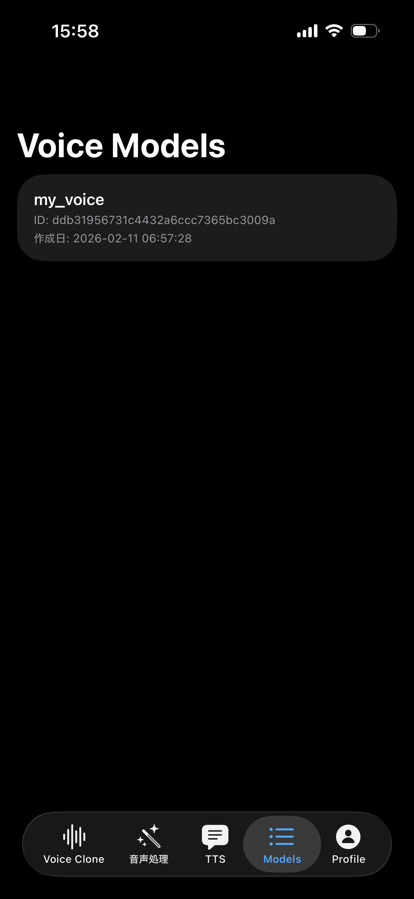 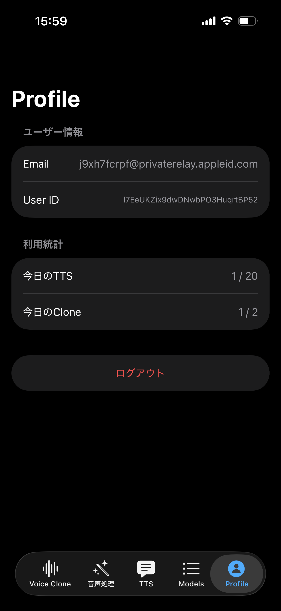

---

# PersonaStamp Studio リポジトリ全体（もともとの README）

このリポジトリには、AXiV のほかに Fish Audio SDK を用いた音声クローン・TTS のツール群が含まれます。以下は、もともとの PersonaStamp Studio README の内容です。

## 📋 概要

PersonaStamp Studioは、Fish Audio SDKを使用した音声クローン（Voice Cloning）とテキスト読み上げ（TTS）の完全なツールキットです。**iOS アプリ（RendVu）**、コマンドライン、Web UI のいずれからも、音声クローンの作成から TTS 生成まで実行できます。

## 📁 プロジェクト構造

```
PersonaStamp_Studio/
├── create_stamp/                 # AXiV iOS アプリ（メインアプリ）
│   ├── mobile/stamp_creator/     # Xcode プロジェクト
│   └── portfolio/                # アプリアイコン・プレビュー動画・画像
├── app/                          # Streamlit Web UI
│   ├── app.py                    # メインのWebアプリケーション
│   ├── create_voice_clone.py     # 音声クローンモデル作成機能
│   ├── generate_tts.py           # TTS生成機能
│   ├── models.json               # モデル情報の永続化ストレージ
│   └── README.md                 # Web UIの詳細ドキュメント
├── src/                          # コマンドライン用スクリプト
│   ├── create_voice_clone.py     # 音声クローンモデル作成
│   ├── generate_tts.py           # TTS音声生成
│   ├── utils/                    # ユーティリティ
│   │   ├── audio_separation.py   # 音源分離（ボーカル抽出）
│   │   └── youtube_downloader.py # YouTube音声ダウンロード
│   └── README.md                 # CLIの詳細ドキュメント
├── api/                          # 各種 API サーバー（TTS / スタンプ用など）
│   └── tts-api-server/.../RendVu/  # 音声クローン・TTS iOS アプリ（Fish Audio SDK）
├── docs/                         # ドキュメント
│   ├── SETUP.md                  # 詳細セットアップガイド
│   ├── PROJECT_SUMMARY.md        # プロジェクトサマリー
│   └── FISH_AUDIO_README.md      # Fish Audio公式ドキュメント
├── examples/                     # 音声サンプル
├── output/                       # 生成された音声ファイル
├── workflow.py                   # 対話式の完全ワークフロー
├── requirements.txt              # 依存パッケージ
├── packages.txt                  # Streamlit Cloud用システム依存
└── README.md                     # このファイル
```

## ✨ 主な機能（Fish Audio SDK）

- 🎤 **音声クローン**: 10-30秒の音声サンプルから声を複製
- 🔊 **高品質TTS**: 自然な音声合成
- 🌐 **Web UI**: StreamlitベースのモダンなWebインターフェース
- 💻 **CLI**: コマンドラインからの実行も可能
- 😊 **感情表現**: (happy), (sad), (excited) などのタグで感情を制御
- ⚡ **韻律制御**: 話速と音量の調整
- 📦 **複数フォーマット**: WAV, MP3, Opus, PCM出力
- 🎵 **音源分離**: 音楽からボーカルのみを抽出（Demucs使用）
- 📺 **YouTube対応**: YouTubeから音声をダウンロード
- 🤖 **自動文字起こし**: Whisperによる自動文字起こし機能

## 🚀 クイックスタート

### 1. 前提条件

- **Python**: 3.10以上（推奨: 3.10.11）
- **Fish Audio APIキー**: [Fish Audio](https://fish.audio) で取得

### 2. インストール

```bash
# リポジトリをクローン
git clone <repository-url>
cd PersonaStamp_Studio

# 依存パッケージのインストール
pip install -r requirements.txt
```

### 3. APIキーの設定

**方法1: .envファイルを使用（推奨）**

```bash
# .envファイルを作成
echo "FISH_AUDIO_API_KEY=your_actual_api_key_here" > .env
```

**方法2: 環境変数で設定**

```bash
# macOS/Linux
export FISH_AUDIO_API_KEY="your_api_key_here"

# Windows (PowerShell)
$env:FISH_AUDIO_API_KEY = "your_api_key_here"
```

### 4. 起動方法

#### 🌐 Web UIを使用（推奨）

```bash
streamlit run app/app.py
```

ブラウザで `http://localhost:8501` が自動的に開きます。

**詳細な使い方は [app/README.md](app/README.md) を参照してください。**

#### 💻 コマンドラインを使用

対話式のワークフローで全ステップを実行:

```bash
python workflow.py
```

個別のスクリプトを実行:

```bash
# 音声クローンモデルの作成
python src/create_voice_clone.py

# TTS音声の生成
python src/generate_tts.py
```

**詳細な使い方は [src/README.md](src/README.md) を参照してください。**

## 📖 使い方の選択

### Web UI（app/）

- ✅ **初心者向け**: 直感的なGUI
- ✅ **モダンなUI**: ダークモード対応
- ✅ **モデル管理**: 視覚的なモデル管理機能
- ✅ **自動文字起こし**: Whisperによる自動文字起こし
- ✅ **スマホ対応**: モバイルブラウザでも動作

→ [app/README.md](app/README.md) を参照

### コマンドライン（src/）

- ✅ **自動化**: スクリプトでの自動実行
- ✅ **音源分離**: 音楽からボーカル抽出
- ✅ **YouTube対応**: YouTubeから音声ダウンロード
- ✅ **バッチ処理**: 複数ファイルの一括処理

→ [src/README.md](src/README.md) を参照

## 🔧 オプション機能

### 音源分離機能

音楽ファイルからボーカル（人の声）のみを抽出します。

```bash
# Demucsをインストール
pip install demucs

# ボーカルのみ抽出
python src/utils/audio_separation.py song.mp3
```

### YouTube音声ダウンロード

```bash
# yt-dlpをインストール
pip install yt-dlp

# YouTubeから音声をダウンロード
python src/utils/youtube_downloader.py "https://www.youtube.com/watch?v=xxxxx"
```

## ☁️ Streamlit Cloudでのデプロイ

Streamlit Cloudでデプロイする場合：

1. GitHubリポジトリにプッシュ
2. [Streamlit Cloud](https://streamlit.io/cloud) でアプリを接続
3. アプリのパスを `app/app.py` に設定
4. 環境変数 `FISH_AUDIO_API_KEY` を設定

**注意**: `packages.txt` に `ffmpeg` が含まれていることを確認してください（Whisper機能に必要）。

## 📚 ドキュメント

- [Web UI 詳細ドキュメント](app/README.md) - Streamlitアプリの使い方
- [CLI 詳細ドキュメント](src/README.md) - コマンドラインスクリプトの使い方
- [詳細セットアップガイド](docs/SETUP.md)
- [プロジェクトサマリー](docs/PROJECT_SUMMARY.md)
- [Fish Audio 公式ドキュメント](https://docs.fish.audio/)

## ⚠️ 注意事項

- **セキュリティ**: APIキーは`.env`ファイルで管理し、絶対にGitにコミットしないでください
- **音声サンプル**: クリアな音質でノイズのないものを使用してください
- **APIクレジット**: APIクレジットの消費に注意してください
- **商用利用**: 商用利用の際はFish Audioの利用規約を確認してください

## 🤝 貢献

Issue、Pull Requestを歓迎します！

## 📄 ライセンス

このプロジェクトはMITライセンスの下で公開されています。本リポジトリの利用条件はプロジェクトのルート方針に従います。

## 🔗 リンク

- [Fish Audio 公式サイト](https://fish.audio)
- [Fish Audio ドキュメント](https://docs.fish.audio/)
- [Fish Audio SDK (PyPI)](https://pypi.org/project/fish-audio-sdk/)
- [Streamlit Documentation](https://docs.streamlit.io/)

## 📞 サポート

質問や問題がある場合は、[Issues](https://github.com/yourusername/PersonaStamp_Studio/issues) にて報告してください。
